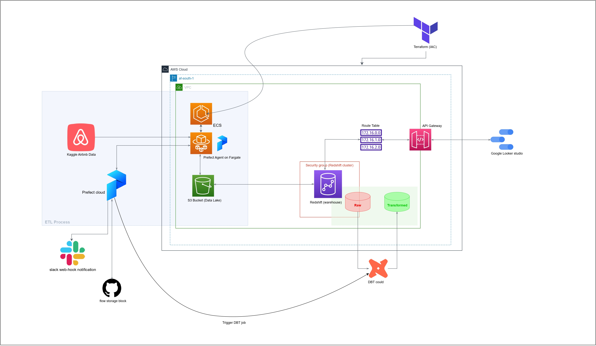
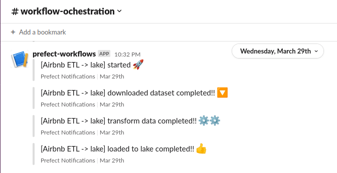
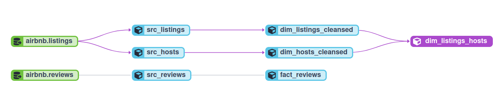

# inside-airbnb-pipeline

<!--  -->

## Overview
The "Airbnb Pipeline" project is a data engineering project that provides a complete end-to-end solution for transforming and analyzing the Airbnb dataset (Sydney). The dataset contains detailed information about Airbnb listings, reviews, and host activity in sydney Australia.

The project provides a set of scripts and tools that automate the process of downloading, cleaning, and transforming the data into a format suitable for analysis. The pipeline uses a combination of Python, SQL, and dbt (data build tool) to extract, load, and transform the data into a set of analytics tables.

The resulting analytics tables provide valuable insights into the short-term rental market, including trends in pricing, availability, and host activity. The project is well-documented and actively maintained, making it a useful resource for anyone interested in analyzing the Inside Airbnb dataset.

 
### Data source:
[Kaggle Airbnb sydney dataset](https://www.kaggle.com/datasets/samibrahim/airbnb-sydney)

## Technologies used

___

| Category         | Logo                                        | Names                          |
|--------------------|---------------------------------------------|-------------------------------|
| Cloud              |  | Amazon Web Service(AWS)     |
| Infrastructure as Code (IaC) |  | Terraform     |
| Workflow Orchestration |  ,    , ,  | Prefect, Slack (Notification), ECS Fargate, Github (storage block) |
| Data Warehouse |  | Redshift |
| Data Lake        |  | AWS S3 Bucket                 |
| Batch Processing | ,  | Python, Pandas                |
| Data Transformations | ,  | DBT, SQL                      |
| Data Visualizations |  | Looker Studio                 |

## Data Pipeline Diagram

**Prerequisites**:
- AWS account with access key to use aws cli
- Prefect cloud account 
- DBT cloud account
- Kaggle account
- slack webhook
- Terraform
- Make

## Project build & setup ⚙️ 

- [setup and build infra](./infra/infra_README.md)

- [setup environment variables](./env_README.md)

- setup & build all code and workflow ochestration deployment
  - `make all`   *run command from root directory*
      
     
  - [or setup and build manually](Makefile)

**Data workflow ochestration**: 
- data extraction & transformation from websource to data lake runs every monday @ 10am UTC
- data extraction from lake to warehouse runs every monday @ 1pm UTC
- data transformation in warehouse runs every monday @ 3pm UTC
      
**Workflow ochestration notification sample**:

 

**Data Transformation**:

- `airbnb.listings` and `airbnb.reviews` are tables from the target schema of the warehouse where the extracted pipeline data was loaded based on the EL (Extract & Load) process
- `src_hosts`, `src_listings` and `src_reviews` are *ephemeral* materialized and transformed tables extracted with selected fields from the loaded data source
- `dim_hosts_cleansed` and `dim_listings_cleansed` are transformed and cleaned *views* from the ephemeral tables
- `dim_listings_hosts` is a dimension table from the join of  `dim_hosts_cleansed` and `dim_listings_cleansed` views

## Project Structure
      .
      ├── dbt_transform
      │   ├── analyses
      │   ├── dbt_packages
      │   ├── dbt_project.yml
      │   ├── macros
      │   ├── models
      │   │   ├── dim
      │   │   │   ├── dim_hosts_cleansed.sql
      │   │   │   ├── dim_listings_cleansed.sql
      │   │   │   └── dim_listings_hosts.sql
      │   │   ├── fact
      │   │   │   └── fact_reviews.sql
      │   │   ├── sources.yaml
      │   │   └── src
      │   │       ├── src_hosts.sql
      │   │       ├── src_listings.sql
      │   │       └── src_reviews.sql
      │   ├── README.md
      │   ├── seeds
      │   ├── snapshots
      │   └── tests
      ├── environment.sh
      ├── env_README.md
      ├── flows
      │   ├── dbt_flow.py
      │   ├── lake_to_warehouse.py
      │   └── websrc_to_datalake.py
      ├── infra
      │   ├── blocks
      │   │   └── prefect_blocks.py
      │   ├── iam.tf
      │   ├── infra_README.md
      │   ├── main.tf
      │   ├── network.tf
      │   ├── outputs.tf
      │   ├── provider.tf
      │   ├── terraform.tfstate
      │   ├── terraform.tfstate.backup
      │   ├── terraform.tfvars
      │   └── variables.tf
      ├── Makefile
      ├── README.md
      ├── requirements.txt
      ├── static
      │   └── capstone-zoomcamp.drawio_page-0001.jpg
      └── test.ipynb

## Further Improvements
There is scope for improvement in several areas of this project, such as:

- Conducting tests
- Implementing CI/CD
 